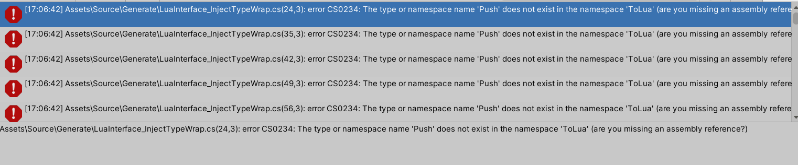

240126

研究tolua、资源管理
初始内容传git 包括Mirror/protobuf/tolua

240129

https://blog.csdn.net/linxinfa/article/details/119493890

unity的热更方案

C#热更新重新加载dll可能被应用市场是做违规操作

lua：动态解释 unity环境中内嵌lua虚拟机 打包成AssetBundle

240130

解决tolua的问题，各种报错修复

240206

### 踩坑记录

问题：

error CS0234: The type or namespace name 'Push' does not exist in the namespace 'ToLua' (are you missing an assembly reference?)

引用到了错误的ToLua（Namespace ToLua），如果指定LuaInterface.ToLua可以。

最终原因：rider编辑器中移动文件时自动加上了ToLua.BaseType的namespace，导致ToLua产生歧义。删除即可。

240207

问题：

error CS1615: Argument 1 may not be passed with the 'ref' keyword

在生成的代码中，方法参数有关键字in，传了ref导致了报错。c#中in, out, ref都是引用的关键字，in的作用在于让他只读不修改。

定位生成的代码ToLuaExport可知对于ref类型的参数，如果是out则生成out，其他的生成ref。

可能是当初没有in关键字，修改后的代码如下。

运行后生成不再报错

关于C#的ref, in, out关键字：https://zhuanlan.zhihu.com/p/449478798

